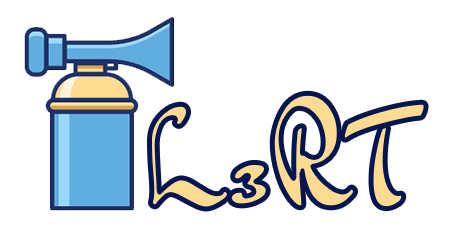

[](https://travis-ci.org/l3rt/l3rt)



# L3rt

Simple alerting application. It was inspired by elastalert and Jenkins pipelines. The goal is to provide users with more sophisticated rule system.

[](http://feathub.com/l3rt/l3rt)

Currently, l3rt supports the following sources as an input:

* ElasticSearch

Supported outputs:

* [Email](docs/mailTarget.md)
* [Hipchat](docs/hipchatTarget.md)
* [Slack](docs/slackTarget.md)
* Missing yours? Add a [feature request](http://feathub.com/l3rt/l3rt) or submit a pull request 

Supported rules:

* ElasticSearch: [query rule](docs/elasticsearchQueryRule.md) - free-form rule that is fully managed by ElasticSearch's `search` query
* ElasticSearch: [count rule](docs/elasticsearchCountRule.md) - returns number of events occurred for the given period of time
* Missing yours? Add a [feature request](http://feathub.com/l3rt/l3rt) or submit a pull request 

## How to use

Create a config file where you need to specify common configuration for all your rules:

```json
{
  "sources": [
    {
      "name": "elasticTest",
      "sourceType": "lert.elasticsearch.ElasticSearchProcessor",
      "params": {
        "host": "localhost",
        "port": "9200",
        "schema": "http"
      }
    }
  ],
  "rules": [
         "/opt/l3rt/rules/"
  ],
  "targetSettings": {
    "mailServer": {
      "host": "smtp.gmail.com",
      "port": "465",
      "auth":  true,
      "username": "myemail@test.com",
      "password": "password"
    }
  }
}
```

You can find more info about config [here](docs/config.md).

Create your rule. All rules are groovy based DSLs, so you can use all power of groovy in your rules.

`/opt/l3rt/rules/exampleRule.groovy`

```groovy
rule {
    ruleName = "myTestRule"
    params = [
            "index": "logstash-*",
            "query": [query: [
                            bool: [
                                must: [
                                        ["range": ["@timestamp": ["gt": [lastSeenTimestamp]]]],
                                        ["match": [ "message": "error" ]]
                                    ]
                                ]
                             ]
                        ]
    ]

    reaction { messages ->
        messages.each {
            if (it.data.message.contains("Critical")) {
                email("manager@mycompany.com", "Error", it.data.message.toString())
                hipchat("Room with logs", it.data.message.toString(), "RED", true)
            } else {
                hipchat("Room with logs", it.data.message.toString(), "YELLOW", true)
            }
        }
    }
}
```

## Build & Launch 

1. Build
`./gradlew application:jar `

2. Run
`CONFIG=~/conf.json java -jar ./l3rt-0.1.0.jar`

NOTE: l3rt requires >= Java 8

### or Docker

`docker run -it -v ~/conf.json:/l3rt/config/config.json -v ~/rules:/l3rt/rules dimafeng/l3rt:0.1.0`

Put your rules inside `~/rules` on your local machine and use them in the `config.json` as follows:

```json
{
  "rules": [
         "/l3rt/rules/"
  ]
}
```

## Contributions

This project is in heavy development stage so all contributions are appreciated. 
